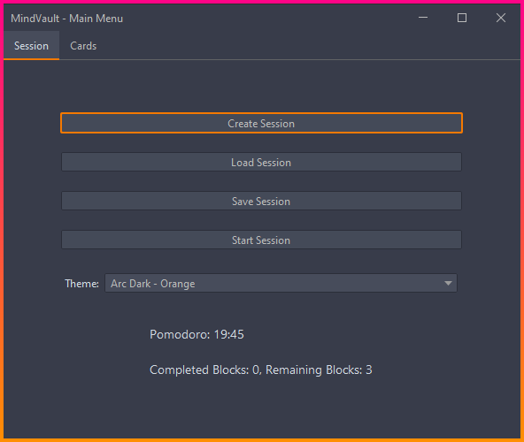

# MindVault 🧠📚

<div align="center">

Welcome to MindVault, the ultimate Java application for efficient and personalized learning! 🎉 MindVault is designed to help you maximize your learning potential while minimizing the risk of overtraining and mental fatigue.

## Features ✨

- 🎯 **Eliminating "mush" in the head (overtraining)**: MindVault adapts the learning process to your individual needs, monitoring your progress and preventing excessive repetition of already learned material. This allows you to focus on new information and maintain mental clarity.
- 🧩 **Full adaptability based on the speed and correctness of your responses**: MindVault dynamically customizes the learning process based on your performance. The application takes into account the speed and accuracy of your responses when determining the difficulty and repetition rate of flashcards, ensuring an optimal learning pace that matches your ability and progress.
- ⏰ **Interval repetitions to eliminate the need to decide what to repeat**: MindVault uses an interval repetition algorithm to automatically determine the optimal repetition intervals for each flashcard. The application takes your performance into account and adjusts the repetition intervals accordingly, eliminating the need for you to decide which flashcards to repeat and when, reducing the associated hassle and uncertainty.
- 🎓 **The "set and learn" concept**: MindVault follows the "set and learn" concept, allowing you to focus on the learning process without worrying about the technical details. Simply set your learning goals and let MindVault handle the rest, providing you with a seamless and efficient learning experience.

## Getting Started 🚀

1. Clone the MindVault repository:
   ```
   git clone https://github.com/DedInc/MindVault
   ```
2. Navigate to the project directory:
   ```
   cd MindVault
   ```
3. Compile and run the application:
   ```
   .\gradlew shadowJar
   cd build/libs
   java -jar MindVault-1.0-all.jar
   ```

## Screenshot 📸



## Contributing 🤝

We welcome contributions from the community! If you have any ideas, suggestions, or bug reports, please open an issue or submit a pull request. Let's make learning even more effective together!

## License 📄

This project is licensed under the [MIT License](LICENSE).

Happy learning with MindVault! 🎉📚🧠

</div>